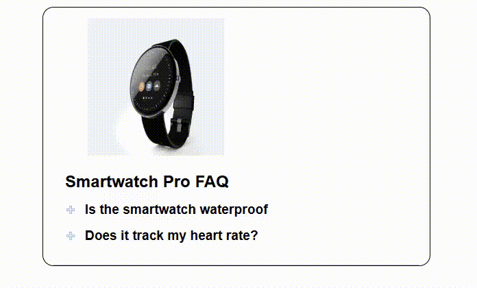

# Smartwatch-FAQ

### Authors
### :purple_heart: [Violet French](https://github.com/Pirategirl9000) 
### :potted_plant: [Sarah Fenton](https://github.com/sarahfenton204)

### Table of Contents
* [Authors](#authors)
* [Output](#camera-output)
* [Purpose](#rotating_light-purpose)
* [New Concepts](#triangular_flag_on_post-new-concepts)
* [Script Breakdown](#newspaper-script-breakdown)
* [Credits](#thumbsup-credits)

### :rotating_light: Purpose
### This program displays an FAQ page for a smartwatch that uses collapsible panels for questions. When the question is clicked an answer appears and a corresponding image is displayed at the top

### :triangular_flag_on_post: New Concepts
* Adding/Removing classes from DOM elements
* Checking for and grabbing custom HTML attributes from DOM elements
* Grabbing next elements based on sibling relationship of DOM elements
* Checking equality of DOM elements
* Finding the target of an `Event` object
* Toggling the class of a DOM element
* Mutation of an array using `Array.forEach()`

### :newspaper: Script Breakdown
#### :earth_americas: Globals
* `faqImage`
  * The image element we will replace on question clicks
* `faqImageOrigSrc`
  * The original image upon program startup
  * Used when both questions are closed to reset the `faqImage` src
* `faqImageOrigAlt`
  * The alt text of the original image on program startup
  * Used when both questions are closed to reset the `faqImage` alt text
* `h2s`
  * All the h2 elements in the HTML which store the questions
  * Used to determine what header element was clicked so we can update the image and div element associated with the answer

#### :construction_worker: Functions and Listeners
* `toggleVisibility`
  * Called by all header elements on click
  * Updates the header element by: toggling the visibilty of the answer, closing all other answer divs, and updating the `faqImage`
* `document.onDOMContentLoaded`
  * Adds an onClick listener to all `h2s` elements that calls `toggleVisibility`

### :camera: Output

### :thumbsup: Credits
###### This script is an adaptation of a script provided by [Debbie Johnson](https://github.com/dejohns2)